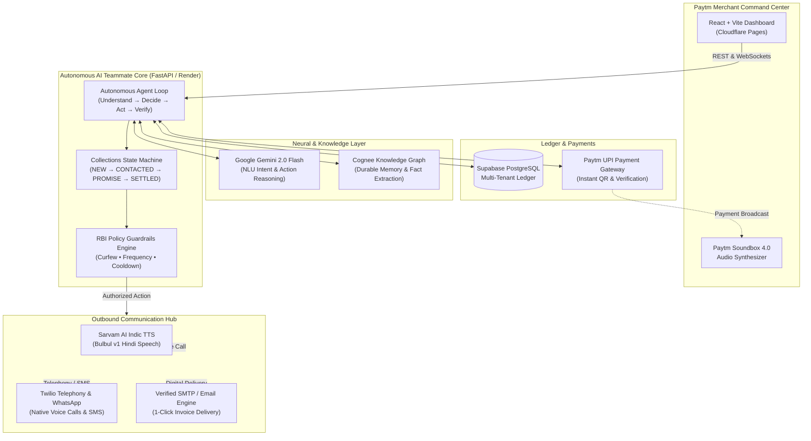

# Paytm for Business — Autonomous Collections Workforce

<div align="center">

[](https://github.com/anshgoyalchd/Paytm-AI-Workforce)
[](https://paytm-ai-workforce.pages.dev)
[](https://paytm-collections-backend.onrender.com)
[](https://github.com/anshgoyalchd/Paytm-AI-Workforce)
[](LICENSE)

<br />

**An autonomous AI employee built for Indian merchants that recovers overdue invoice payments across Voice, WhatsApp, and Email with strict RBI Fair Practice guardrails and real-time payment reconciliation.**

[🚀 Live Dashboard](https://paytm-ai-workforce.pages.dev) • [📖 API Documentation](https://paytm-collections-backend.onrender.com/docs) • [📊 System Architecture Spec (PDF)](docs/Paytm_AI_Collections_Workforce_Architecture_Spec.pdf) • [⚠️ Prototype Limitations (PDF)](docs/Paytm_AI_Collections_Prototype_Limitations_and_Roadmap.pdf)

</div>

---

## 📌 Executive Summary

Small and medium enterprises (MSMEs) in India lose billions of rupees each year to delayed and unpaid invoices. Traditional debt collection relies on awkward manual phone calls, scattered WhatsApp chats, and spreadsheets—straining customer relationships and consuming hundreds of hours of merchant time.

Most AI solutions in this space are mere **chatbots** that wait for a human to type a query.

**Paytm AI Workforce is fundamentally different.** It is an **autonomous AI employee (Track 3: AI Teammates)** that proactively takes charge of the merchant's receivables ledger:

1. **Continuous Ledger Monitoring**: Identifies delinquent accounts, overdue aging tiers, and payment track records.
2. **Contextual Intelligence**: Analyzes past broken promises, communication notes, and customer sentiment stored in durable graph memory.
3. **Multimodal Contact**: Dispatches natural Indic voice calls in Hindi, interactive WhatsApp messages, or verified emails.
4. **Autonomous Negotiation**: Conducts conversations, understands customer intent (immediate payment, payment disputes, hardship, broken commitments), and negotiates realistic payment schedules.
5. **Deterministic Policy Guardrails**: Strictly enforces RBI Fair Practices Code (09:00–19:00 IST curfew, frequency caps, and anti-harassment limits) before any message or call can be dispatched.
6. **Payment Reconciliation & Soundbox 4.0**: Reconciles settlements and broadcasts authentic audio payment confirmations (*"पेटीएम पर 10,000 रुपये प्राप्त हुए"*).
7. **Human-in-the-Loop Escalation**: Automatically routes hardship claims and unresolved disputes to the business owner with 1-click resolution actions.

---

## 🏗️ System Architecture



---

## ✨ Key Features

### 1. Autonomous 7-Step Recovery Loop
Unlike standard conversational agents, the AI teammate executes an end-to-end autonomous lifecycle:
- **Understand**: Analyzes customer incoming messages or aging invoices using **Gemini 2.0 Flash**.
- **Remember**: Queries **Cognee Knowledge Graph** for previous broken promises, hardship reasons, or payment agreements.
- **Decide**: Determines optimal next action (`CALL`, `WHATSAPP`, `EMAIL`, `WAIT_FOR_PROMISE`, `VERIFY_PAYMENT`, `ESCALATE`).
- **Policy Check**: Deterministic validation against RBI Fair Practices Code and merchant policy before dispatching.
- **Act**: Executes communication via Twilio or Email with unique Paytm UPI payment links.
- **Verify**: Cross-checks claims of payment against the payment gateway.
- **Escalate / Close**: Updates database ledger, creates audit trails, and alerts the operator if human intervention is required.

### 2. Native Indic Voice Telephony (Hindi)
- Integrates **Sarvam AI (`Bulbul v1`)** for natural, human-sounding Hindi speech synthesis.
- Places real outbound voice calls via **Twilio Telephony** directly to customer mobile numbers.
- Handles conversational responses, promise scheduling, and payment guidance.

### 3. Interactive Paytm Soundbox 4.0 Simulation
- Replicates India's most iconic fintech hardware—the **Paytm Soundbox**.
- Instant audio confirmation upon verified payment:  
  > *"पेटीएम पर 10,000 रुपये प्राप्त हुए"* (*"10,000 Rupees received on Paytm"*)
- Built-in speech synthesizer visualizer with real-time soundwave equalizers.

### 4. Paytm UPI 1-Click Payment Hub
- Generates dynamic, compliant **Paytm UPI QR codes** and payment links (`upi://pay?pa=...`).
- Interoperable across all Indian UPI apps: **Paytm, PhonePe, Google Pay, BHIM, and CRED**.
- Direct copy-to-clipboard and 1-click payment dispatch.

### 5. Deterministic RBI Governance & Policy Engine
- **Fair Practices Code Compliance**: Hard curfew preventing automated customer contact outside **09:00 – 19:00 IST**.
- **Anti-Harassment Limits**: Caps maximum touches at 2 attempts per day with mandatory 4-hour cooldowns.
- **24/7 Sandbox Testing Mode**: One-click toggle allowing hackathon evaluators to test live calls and messages at any time.

### 6. Human-in-the-Loop Escalation Center
- AI automatically detects edge cases requiring human judgment:
  - *Hardship claims* (medical emergencies, business insolvency).
  - *Invoice disputes* (goods damaged, quantity mismatch).
  - *Repeated broken promises* (3+ missed commitments).
- Merchant console features 1-click resolutions: **Grant Extension**, **Waive Late Fee**, or **Assign Field Rep**.

---

## 🛠️ Technology Stack

| Layer | Technologies Used | Description |
| :--- | :--- | :--- |
| **Frontend** | React 19, TypeScript, Tailwind CSS, Vite | Responsive Paytm for Business enterprise UI hosted on Cloudflare Pages |
| **Backend API** | Python 3.12, FastAPI, Pydantic, SQLAlchemy | High-performance asynchronous REST API hosted on Render |
| **Database** | Supabase (PostgreSQL 15) | Multi-tenant relational schema with complete audit logging |
| **Reasoning Engine** | Google Gemini 2.0 Flash | Fast, low-latency reasoning and intent classification |
| **Indic Speech** | Sarvam AI (`Bulbul v1`) | High-fidelity Indian voice synthesis (Hindi & Hinglish) |
| **Telephony & Messaging** | Twilio API | Real outbound voice phone calls and SMS/WhatsApp dispatches |
| **Durable Memory** | Cognee Cloud Knowledge Graph | Semantic graph memory for past commitments and customer sentiment |
| **Automation** | n8n Workflow Engine | Webhook dispatch pipeline for multi-step notifications |
| **Keep-Alive Worker** | Cloudflare Workers | 5-minute automated cron preventing Render free container hibernation |

---

## 🚀 Live Demo & Evaluation Credentials

You can test the fully deployed system right now:

- **Dashboard**: [https://paytm-ai-workforce.pages.dev](https://paytm-ai-workforce.pages.dev)
- **API Swagger**: [https://paytm-collections-backend.onrender.com/docs](https://paytm-collections-backend.onrender.com/docs)
- **Edge Warmup Proxy**: [https://paytm-backend-keepalive.ansh-goyalchd.workers.dev](https://paytm-backend-keepalive.ansh-goyalchd.workers.dev)

### Default Demo Account
| Field | Value |
| :--- | :--- |
| **Merchant Name** | Ansh Pharmsy (Verified Merchant) |
| **Email** | `ansh.goyalchd@gmail.com` |
| **Password** | *Use sign-in or register any new business for isolated multi-tenant data* |

> 💡 **Tip for Judges**: Navigate to the **AI Scenario Testing Studio** tab to simulate any of the 8 canonical debt recovery scenarios in a live sandbox with real-time trace inspection and Hindi voice preview.

---

## 💻 Local Development Setup

### Prerequisites
- **Python**: 3.10 or higher
- **Node.js**: 18.0 or higher
- **Package Managers**: `pip` and `npm`

### 1. Clone the Repository
```bash
git clone https://github.com/anshgoyalchd/Paytm-AI-Workforce.git
cd Paytm-AI-Workforce
```

### 2. Backend Setup
```bash
# Create and activate virtual environment
python -m venv venv
# On Windows:
.\venv\Scripts\activate
# On macOS/Linux:
source venv/bin/activate

# Install Python dependencies
pip install -r backend/requirements.txt

# Seed local database with demo merchant & overdue invoices
python -m database.seed.demo_data

# Start FastAPI server
python -m uvicorn backend.app.main:app --reload --port 8000
```
- Local API Docs: `http://localhost:8000/docs`
- Health Check: `http://localhost:8000/health`

### 3. Frontend Setup
```bash
cd frontend

# Install Node dependencies
npm install

# Start local Vite development server
npm run dev
```
- Open `http://localhost:5173` in your browser.

### 4. Running the Test Suite
The repository includes a comprehensive 31-test verification suite covering unit, integration, and end-to-end acceptance flows:
```bash
# Run pytest from the repository root
python -m pytest tests/ -v
```

Test Coverage Breakdown:
- `tests/e2e/test_acceptance_scenarios.py`: Validates all 24 canonical recovery scenarios.
- `tests/integration/test_api_endpoints.py`: Tests REST endpoints, authentication, and case creation.
- `tests/unit/test_collections_agent.py`: Verifies autonomous decision trees and prompt reasoning.
- `tests/unit/test_policy_engine.py`: Enforces RBI contact hour curfews and cooldown logic.
- `tests/unit/test_state_machine.py`: Guards case state transitions (`NEW` → `CONTACTED` → `PROMISE` → `SETTLED`).

---

## 🔒 Security, Compliance & Data Privacy

- **RBI Fair Practices Code**: Automated curfews prevent customer outreach outside 09:00–19:00 IST. Strict limits on daily touch counts prevent harassment.
- **Multi-Tenant Isolation**: Every invoice, customer, communication record, and audit log is partitioned by `merchant_id`. Cross-tenant data leakage is strictly prevented.
- **PCI-DSS Level 1 Standards**: No payment card data or banking credentials are ever stored on application servers; all payments utilize standard tokenized UPI intent URLs and verified gateway callbacks.
- **Full Audit Trail**: Every AI decision, detected intent, confidence score, policy evaluation, and dispatched communication is immutably logged for regulatory compliance.

---

## 🎯 Alignment with Hackathon Track 3: AI Teammates

> **Track Theme**: *"Build AI teammates that don't just respond; they get the job done."*

Paytm AI Workforce exemplifies this theme:
- **It Doesn't Just Answer Questions**: It runs autonomous collection cycles in the background, monitors due dates, and initiates outreach without waiting for merchant prompts.
- **It Negotiates & Reconciles**: It doesn't output generic advice; it conducts conversations across real phone lines, negotiates realistic payment dates, sends UPI payment links, and reconciles payments against the gateway.
- **It Understands Boundaries**: It operates within deterministic legal guardrails and safely hands off edge cases to human operators when policy boundaries are reached.

---

## 📄 License & Attribution

This project is licensed under the **MIT License** — see the [LICENSE](LICENSE) file for details.  
Built with ❤️ for the Google DeepMind & Paytm Hackathon.


---

## 👥 Contributors

- Ranjan Raj Pandey — Project Development & Contribution
