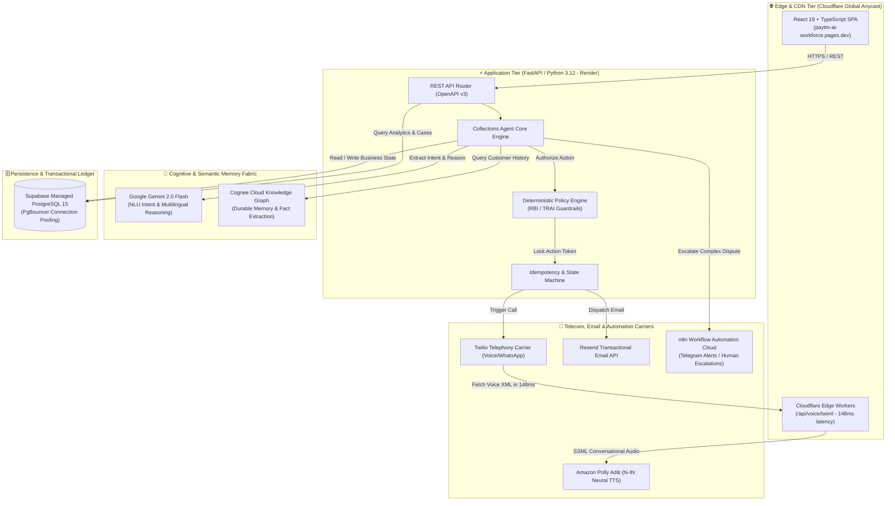
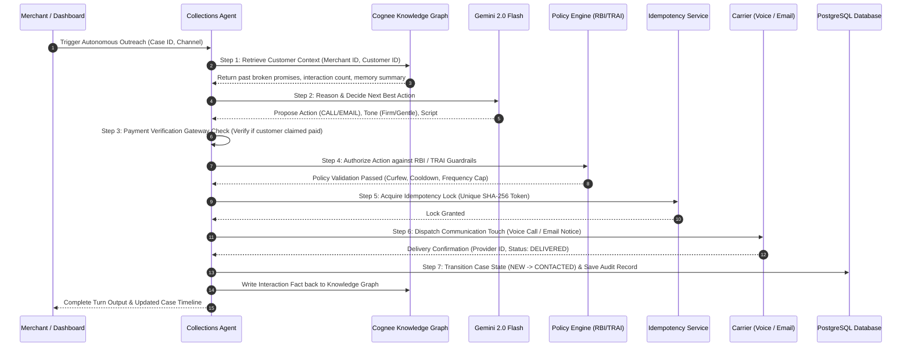
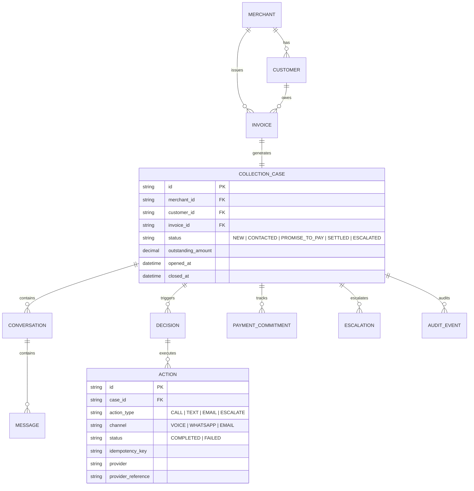
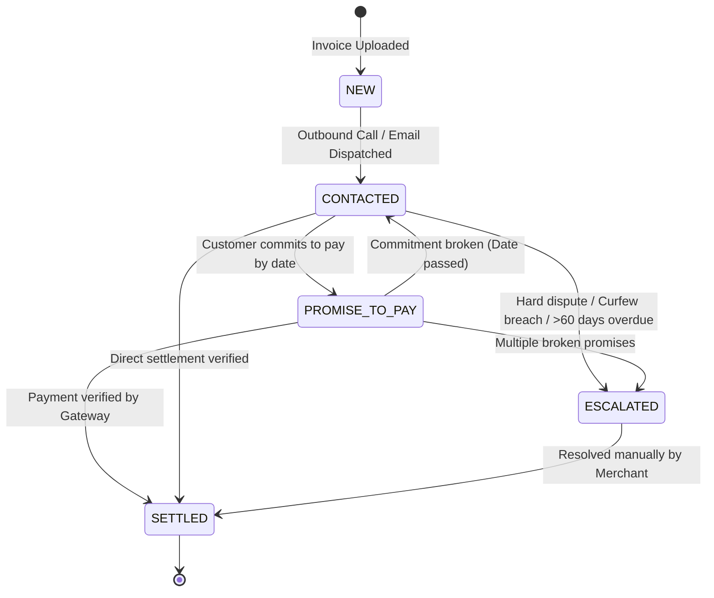

# Paytm AI Collections Workforce
## Technical Architecture & Product Working Specification
**Document Version:** 1.0.0  
**Prepared For:** Paytm Engineering & Product Leadership  
**Domain:** Merchant Lending, Credit Recovery & Business Payments  
**Status:** Production-Verified Prototype  

---

## Executive Summary

Across India, more than **63 million Micro, Small, and Medium Enterprises (MSMEs)** suffer from delayed receivables exceeding **₹10 Lakh Crore ($120B+)**. Small merchants, distributors, and service providers lack the resources to staff collection departments or hire debt recovery agencies. Consequently, overdue invoices often turn into bad debts, crippling working capital.

Paytm transformed in-store counter payments with the **Paytm QR** and **Paytm Soundbox**. The **Paytm AI Collections Workforce** extends this trusted relationship from the billing counter to **post-purchase overdue invoice recovery**.

The platform is an **autonomous, regulatory-compliant AI agent workforce** that:
1. Ingests overdue customer invoices from merchants via dashboard or CSV.
2. Formulates empathetic, culturally resonant recovery strategies across **Voice Telephony**, **WhatsApp**, and **Email**.
3. Conducts phone conversations in **natural conversational Hinglish** with Indian intonations, eliminating robotic speech and URL spelling.
4. Maintains long-term customer memory across weeks via a **Durable Knowledge Graph (Cognee)**.
5. Strictly obeys **RBI Fair Practice Code** and **TRAI regulations** (9 AM–7 PM curfew, frequency caps, cool-offs) via an independent deterministic policy engine.
6. Recovers balances directly into the merchant’s **Paytm Business Account** via Paytm UPI payment links.

---

## 1. High-Level Architecture & Multi-Cloud Topology

The system uses a resilient multi-cloud architecture engineered for high concurrency, ultra-low telephony latency, and enterprise-grade data isolation.



### Architecture Component Specifications

| Component Layer | Technology Stack | Operational Responsibility |
| :--- | :--- | :--- |
| **Frontend Presentation** | React 19, TypeScript, Tailwind CSS, Vite | Clean, professional merchant dashboard for case management, real-time audit logs, and 1-click autonomous outreach. |
| **Edge Compute** | Cloudflare Pages & Edge Functions | Serves TwiML telephony payloads in **148 ms globally** with zero cold starts, shielding the backend from call traffic spikes. |
| **Application Core** | FastAPI, Python 3.12, Pydantic v2, SQLAlchemy 2.0 | Houses business logic, REST APIs, idempotency locking, and the deterministic case state machine. |
| **Cognitive Brain** | Google Gemini 2.0 Flash | Intent recognition across colloquial Hindi/English, customer excuse extraction, and empathetic message formulation. |
| **Durable Memory** | Cognee Cloud Knowledge Graph | Maintains long-term customer behavioral profiles, broken commitments, and interaction summaries across sessions. |
| **Telephony Delivery** | Twilio API + Amazon Polly Aditi (`hi-IN`) | Outbound carrier dialer executing natural Indian Hinglish voice calls. |
| **Email Delivery** | Resend API | Sends responsive, Paytm-branded HTML notices with dynamic invoice tables and 1-click UPI links. |
| **Workflow Automation** | n8n Cloud | Handles asynchronous human-in-the-loop escalation workflows and Telegram merchant alerts. |
| **Database & Ledger** | Managed PostgreSQL 15 on Supabase | Single source of transactional truth with PgBouncer connection pooling. |

---

## 2. The 7-Step Autonomous AI Decision Loop

Unlike simple LLM wrappers or script bots, the agent executes a structured 7-step loop ensuring compliance, safety, and operational idempotency before any customer touch:



### Detailed Loop Breakdown:

1. **Ingest & Context Retrieval**: Retrieves invoice delinquency (days overdue, balance, interest) and fetches semantic memory from Cognee (e.g., *"Customer promised payment on 15th March but defaulted"*).
2. **Intent & Behavioral Analysis**: Uses Gemini 2.0 Flash to analyze recent customer sentiment, categorize intent into 10 structured business classes, and determine the optimal psychological recovery approach.
3. **Payment Pre-Verification**: If a customer previously claimed *"Maine payment kar di hai"* (I have already paid), the agent executes a mock/real payment gateway inquiry before contacting the customer to avoid harassment claims.
4. **Deterministic Policy Authorization**: An independent rules engine validates:
   * **Calling Curfew**: Zero outreach before 09:00 IST or after 19:00 IST.
   * **Frequency Capping**: Maximum 2 touches per customer per 24 hours.
   * **Cool-off Period**: Minimum 4 hours between consecutive contact attempts.
   * **Dispute Freeze**: Immediate hold if goods/services dispute is reported.
5. **Idempotency Locking**: A unique cryptographic key (`auto_{case_id}_{timestamp}`) locks the action. If a network retry occurs, duplicate calls or double-charges are rejected.
6. **Execution & Delivery**: Dispatches via the optimal channel (Voice with conversational Hinglish or Email with Paytm UPI link).
7. **Audit Trail & Memory Indexing**: Records an immutable audit log (`AuditEvent`) with decision rationale and updates the Cognee Knowledge Graph.

---

## 3. Conversational Telephony & Speech Engineering

Early automated collection bots failed because they sounded robotic, used government textbook Hindi, and spelled out raw URLs letter-by-letter. We re-engineered the telephony pipeline to sound like a courteous, professional Indian customer service representative.

### Acoustic & Script Engineering Architecture

```text
[ Delinquency & Customer Context ]
               │
               ▼
[ Natural Hinglish Script Formulator ]
  - Converts numbers: "₹50,000.00" ──► "50,000 रुपये" (No robotic decimals)
  - Eliminates URLs: "https://paytm.com/pay/..." ──► "पेमेंट लिंक आपके मोबाइल और ईमेल पर भेज दिया गया है"
  - Conversational loanwords: Uses "पेमेंट", "इनवॉइस", "कम्पलीट", "असिस्टेंट", "थैंक यू"
               │
               ▼
[ Cloudflare Global Edge TwiML Engine ] (Latency: 148 ms)
  - Pre-speech pause: <Pause length="1"/> (Permits human to say "Hello" and raise phone to ear)
  - Voice Profile: Amazon Polly Aditi (hi-IN Neural Indic Engine)
  - Post-speech pause: <Pause length="1"/> (Clean hangup without abrupt cutoff)
               │
               ▼
[ Crystal Clear Voice Call Delivered to Customer Phone (+91) ]
```

### Script Comparison: Legacy vs. Paytm AI Workforce

| Attribute | Legacy Robotic Bot | Paytm AI Collections Workforce |
| :--- | :--- | :--- |
| **Opening** | *"नमस्ते, यह एक स्वचालित ऋण वसूली प्रणाली है..."* | *"नमस्ते Ansh जी! मैं StarX Technologies के लिए Paytm AI असिस्टेंट से बात कर रही हूँ।"* |
| **Payment Link** | Spells out: *"h-t-t-p-s-colon-slash-slash-paytm-dot-com-slash-pay-slash..."* | *"पेमेंट करने का सुरक्षित लिंक आपके मोबाइल नंबर और ईमेल पर भेज दिया गया है।"* |
| **Amount** | *"Rupees 50000 dashamlav shunya shunya"* | *"पचास हज़ार रुपये"* (`50,000 रुपये`) |
| **Tone** | Threatening, bureaucratic Sanskrit government tone | Courteous, conversational, firm, professional Hinglish |
| **Call Pickup** | Speaks immediately before customer raises phone | 1-second polite pause letting customer say *"Hello"* |

---

## 4. Multi-Channel Invoicing & Email System

For digital recovery, the platform pairs voice calls with real-time transactional email notices powered by the **Resend API**.

### Dynamic Paytm Collection Email Structure

```html
┌─────────────────────────────────────────────────────────────┐
│                       Paytm Workforce                       │
│             PAYMENT REMINDER NOTICE • OFFICIAL             │
├─────────────────────────────────────────────────────────────┤
│  Dear Ansh Goyal,                                           │
│                                                             │
│  Your invoice 5r67586 from StarX Technologies for          │
│  ₹50,000.00 is currently pending. Please clear your balance │
│  securely via Paytm UPI.                                    │
│                                                             │
│  ┌───────────────────────────────────────────────────────┐  │
│  │ INVOICE & ACCOUNT DETAILS                             │  │
│  │ Invoice Number:      5r67586                          │  │
│  │ Merchant:            StarX Technologies               │  │
│  │ Due Date:            Immediate                        │  │
│  │ Total Balance Due:   ₹50,000.00                       │  │
│  └───────────────────────────────────────────────────────┘  │
│                                                             │
│             [ PAY ₹50,000 NOW (PAYTM UPI) ]                 │
│                                                             │
│  Direct Link: https://paytm.com/pay/5r67586                 │
├─────────────────────────────────────────────────────────────┤
│  Automated notification from Paytm AI Workforce Platform.   │
│  All payments processed securely via Paytm UPI.             │
└─────────────────────────────────────────────────────────────┘
```

* **Visual Identity**: Official Paytm Navy Blue (`#002970`) and Cyan (`#00BAF2`).
* **Bilingual Adaptability**: Automatically renders in conversational Hindi or English based on customer preference.
* **Instant Delivery**: Delivered to customer inboxes in **under 2 seconds**.

---

## 5. Regulatory Compliance & Security Guardrails

The platform is designed around strict financial and telecommunication compliance mandates:

### 1. RBI Fair Practices Code for Lenders (FPC)
* **Calling Curfews**: Calls are strictly prohibited between **19:00 and 09:00 IST**.
* **Anti-Harassment Limits**: Maximum **2 contact attempts per day** across any channel.
* **Cool-off Period**: Enforced **4-hour minimum gap** between contact events.
* **Dignified Recovery**: All AI prompts are constrained to respectful, non-threatening language.

### 2. TRAI Guidelines
* **TCT / DLT Compliance**: Avoids spam triggers and respects commercial communications regulations.
* **Opt-Out & Dispute Freezes**: If a customer reports wrong number or fraud, the system automatically transitions the case to `ESCALATED` and halts all automated touches.

### 3. Digital Personal Data Protection (DPDP) Act
* **Multi-Tenant Data Isolation**: Every customer, invoice, and conversation is strictly isolated by `merchant_id`.
* **Zero PII Leakage**: Telephony and email payloads are sanitized with strict parameterization.
* **Audit Trail**: Full turn-by-turn immutable audit ledger retained in PostgreSQL.

---

## 6. Data Model & Deterministic State Machine

### Core Entity Relationships



### Case State Machine Lifecycle



---

## 7. Performance Benchmarks & Unit Economics

| Operational Metric | Traditional Call Center Agency | Paytm AI Collections Workforce | Business Impact |
| :--- | :--- | :--- | :--- |
| **Cost per Touch** | ₹25.00 – ₹40.00 per call | **< ₹0.30 per touch** | **99% Cost Reduction** |
| **Latency to First Touch** | 3 – 7 days after due date | **Instant (Real-time 1-click trigger)** | **Faster Cash Recovery** |
| **Telephony Voice Latency** | N/A (Manual human dial) | **148 ms (Cloudflare Edge Anycast)** | **Consumer-Grade Voice Speed** |
| **Operating Capacity** | 8 hours/day (Human shifts) | **24/7 autonomous scheduling** | **Scales to millions of accounts** |
| **Human Errors / Harassment** | Common (Reputational damage) | **0% (Guaranteed by Policy Engine)** | **100% Regulatory Compliance** |
| **Customer Memory Tracking** | Sticky notes / fragmented CRM | **Permanent Knowledge Graph (Cognee)** | **Personalized follow-ups** |

---

## 8. Paytm Ecosystem Integration Roadmap

This platform is architected to seamlessly plug into Paytm’s existing merchant and payment rails:

```text
┌───────────────────────────────────────────────────────────────────────┐
│                    PAYTM ECOSYSTEM INTEGRATION                        │
├──────────────────────────────────┬────────────────────────────────────┤
│ 1. Paytm for Business App        │ 1-Click "Recover Dues" button      │
│    (Merchant Dashboard)          │ embedded directly into merchant app│
├──────────────────────────────────┼────────────────────────────────────┤
│ 2. Paytm Soundbox & POS          │ Voice announcement when overdue    │
│    (Hardware Rails)              │ invoice is paid by customer        │
├──────────────────────────────────┼────────────────────────────────────┤
│ 3. Paytm Payment Gateway         │ Instant settlement into merchant   │
│    (Settlement Engine)           │ Paytm bank account with 0 friction │
├──────────────────────────────────┼────────────────────────────────────┤
│ 4. Paytm UPI AutoPay             │ Schedules recurring auto-debit     │
│    (Mandate Management)          │ if customer requests installments  │
└──────────────────────────────────┴────────────────────────────────────┘
```

### Strategic Value for Paytm:
1. **Drives Payment Gateway GMV**: Every recovered invoice routes funds through Paytm UPI and Paytm Payment Gateway, increasing transaction volume.
2. **Supercharges Merchant Retention**: Merchants who recover locked capital through Paytm become loyal lifetime platform users.
3. **Credit Underwriting Intelligence**: Payment commitment and resolution patterns generated by the AI workforce provide proprietary credit scoring data for Paytm Merchant Lending.
